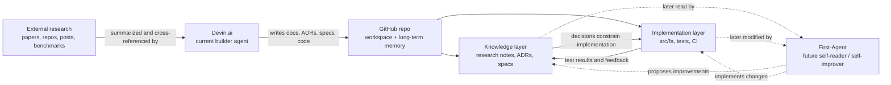

# Project Overview — First-Agent

> **Status:** filled 2026-04-27. Source for v0.1 scope decisions in
> [ADR-1](./adr/ADR-1-v01-use-case-scope.md). Refresh whenever
> something on this page changes (do not let it drift).

## 1. Problem statement

First-Agent (FA) is a **locally orchestrated, mixed-tier LLM coding
agent** for a single power-user. It exists because:

- Hosted coding agents (Devin, Cursor, Copilot Workspace) are great
  but expensive at scale and constrained to their own context-/memory-
  models. We need a setup where **planner / coder / debug roles can
  use different LLM tiers** (top-tier OSS / mid-tier OSS / Anthropic
  elite) under our config control.
- Local "GraphRAG" stacks (MS GraphRAG, LightRAG, HippoRAG) optimise
  *reading* but produce write-side bookkeeping the user has to
  maintain. LLM-Wiki stacks (Karpathy, AI-Context-OS, sparks) optimise
  *writing* but read-side is often grep+BM25 only.
- We want the **hybrid**: filesystem-canon (human-readable, git-able,
  diff-reviewable) **plus** a search-side that scales by lazily
  adding capability (BM25 → vectors → graph) only when the corpus
  justifies it.

## 1.1. Четыре столпа цели (project goal — four pillars)

> **Status:** added 2026-05-06 как явная фиксация project goal.
> Заменяет неявную trifecta «учебный + working + token-efficient метрика»
> из исходного `README` §1 / §3 формулировок. Старые формулировки
> сохраняются в git history; новые — canonical с этой даты.

Goal проекта формулируется в 4 явных столпах:

### Pillar 1 — Research-backed implementation-first reference

First-Agent — implementation-first проект с явной целью стать
open-source reference implementation для locally orchestrated coding
agents. Каждое архитектурное решение фиксируется через ADR
([`knowledge/adr/`](./adr/)) + research note
([`knowledge/research/`](./research/)). Этот ригор делает репо
одновременно учебным инструментом и forkable reference: fork-нувший
читает не «как сделано», а «почему именно так и какие альтернативы
отвергнуты».

### Pillar 2 — Pragmatic single-user product

v0.1 ships как locally orchestrated, mixed-tier coding agent для
single power-user под UC1 (coding+PR) + UC3 (local-docs-to-wiki).
Hybrid-shape (filesystem-canon Markdown + lazy search-side scaling
BM25 → vectors → graph) — sustained design choice, не временное
решение. Архитектура зафиксирована в ADR-1..ADR-6.

### Pillar 3 — Most token/tool-call efficient harness (open-source scope)

Один из главных проектных axes — построить **наиболее token- и
tool-call-efficient harness** среди известных open-source /
open-design агент-стэков под целевые UC1+UC3 при single-user
single-workstation use. «Эффективный» означает измеримое:

1. Median tokens / completed task (UC1).
2. Median tool-calls / completed task (UC1).
3. Tools-in-context при старте session (UC1).
4. API cost (USD) / completed task (UC1).

Числа фиксируются после landing UC5 (eval-harness) и первого
baseline-run. До baseline KPI-numbers стоят как `TBD` и не
блокируют v0.1 deliverable.

**Scope-ограничение явно:** «efficient» = **относительно open-source
agents**. Сравнение с closed-source (Devin, Cursor, Copilot Workspace)
не входит в обязательство — у них недокументированы internal
harness-shape и нет reproducible eval. Verifiable claim требует open
code-base на обеих сторонах сравнения; это **structural property**
проекта, не конкурентное самоограничение.

### Pillar 4 — Iteration via measurement

Эффективность не декларируется — она измеряется и улучшается
итерациями. **База в v0.1:** способность агента писать собственные
skills (`SKILL.md`-файлы под `~/.fa/skills/` или
`knowledge/skills/`) по итогам решённых задач и найденных улучшений.
Pattern взят из Anthropic Claude Skills + Devin `.devin/skills/`,
адаптирован под Mechanical Wiki shape (frontmatter + FTS5-индекс
по ADR-3 / ADR-4). Skill-writing capability требует **ADR-8 (TBD)**;
здесь фиксируется как v0.1 commitment, конкретный design — в
последующем PR.

**Поверх в UC5 v0.2:** benchmark-suite → eval report → manual or
skill-write-based modification → re-benchmark → leaderboard.
Подробнее expanded scope — ADR-1 §Amendment 2026-05-06.

## 1.2. Enforceable principle — minimalism-first

> **Принцип, не goal.** Каждый предлагаемый новый компонент harness
> (тулзов, prompt-уровня, retrieval-стадия) должен пройти 4-вопросный
> тест перед добавлением:
>
> 1. Какая research-evidence (peer-reviewed paper, primary-source
>    blog от lab/foundation, eval-report) поддерживает необходимость
>    этого компонента под наш UC1+UC3 single-user scope?
> 2. Существует ли open-source агент-стэк, который **уже** удалил
>    или не добавил похожий компонент, и какой был результат?
> 3. Если компонент не добавить — какой конкретный capability мы
>    теряем, и можно ли заменить его существующим тулом или
>    config-настройкой?
> 4. Можно ли реализовать этот шаг детерминированной Python-функцией
>    **без LLM-вызова**? Если LLM-вызов не нужен для качества
>    результата (например, шаг — это парсинг, форматирование, агрегация,
>    fan-out по списку, lookup в файле), функция — правильный
>    дефолт; LLM-вызов оправдан только когда требуется суждение,
>    которое нельзя выразить детерминированно.
>
> Если ответ на (1) — «нет evidence», или (2) — «удалили без потерь»,
> или (3) — «можно заменить», или (4) — «функция справится» — компонент
> **rejected** в текущей форме (LLM-step) в v0.1; для (4) допустимо
> вернуться с design'ом, где этот шаг — код, а не вызов модели.
>
> После UC5 landing — re-check: новый компонент должен снизить хотя
> бы один KPI Pillar 3 на reproducible benchmark; иначе rejected.

**Зачем minimalism-first, а не subtraction-first.** Greenfield-проект
v0.1 не унаследовал «лишних компонентов», которые надо вырезать.
«Subtraction» (вырезать post-hoc после improving models) —
retrofit-стратегия, осмысленная для legacy harness. **Minimalism**
(не добавлять без evidence) — prevention-стратегия, осмысленная при
старте с чистого листа. Проект выбирает prevention: читаем research
papers, изучаем опыт чужих ошибок (failure modes других harness'ов,
overengineering Critic-loops, dynamic prompt-assembly без cache-
invariant), не добавляем сами.

References supporting principle: см.
[`research/efficient-llm-agent-harness-deep-dive-2026-05.md`](./research/efficient-llm-agent-harness-deep-dive-2026-05.md)
§3.5 + §0 R-7 (Anthropic «code execution with MCP» subtraction
principle, Tsinghua module-ablation `arXiv:2603.25723`).

## 1.3. Three-stage project evolution

> **Status:** added 2026-05-10 как явная фиксация лестницы развития
> проекта. Заменяет неявную модель «v0.1 → v0.2 → v0.3», которая
> описывала только code-side прогресс. Эта секция описывает
> **agent-side** прогресс: кто на каждом этапе пишет код / документацию
> и кто их читает. Phase S / Phase M / v0.1 / v0.2 milestones из
> ADR-1..6 продолжают применяться **внутри** Stage 1.

Проект двигается через три этапа, различающиеся тем, **какой агент
выполняет основную работу** и **в каком режиме** Devin участвует.

### Stage 1 — Documentation + agent development через Devin (текущий)

Devin.ai — основной builder agent. Devin читает external research
(papers, repos, posts, benchmarks), пишет ADR-ы, research notes,
specs и код под `src/fa/`. GitHub-репозиторий — workspace и
long-term memory; всё, что Devin производит, фиксируется как
filesystem-canonical Markdown + Python.

**Где мы сейчас:** Phase S scaffolding complete; ADR-7 closes the
inner-loop / tool-registry contract before the first feature-module PR
(Phase M). Chunker (`src/fa/chunker/`) реализован, не оттестирован
end-to-end. ADR-1..7 accepted.

**Конец Stage 1:** работающий первый release **First-Agent 0.1**,
ready для локального запуска под UC1 (coding+PR) + UC3 (docs-to-wiki).

### Stage 2 — First-Agent 0.1 локально + iteration через Devin

First-Agent 0.1 запускается на single workstation владельца проекта;
прогоны под UC1 / UC3 / UC5 baseline.

Devin продолжает быть основным builder'ом, но теперь работает в
тандеме с реальным первым агентом: пишет новую документацию по
результатам прогонов first-agent'а, оптимизирует harness, готовит
v0.2 ADR-ы.

**Конец Stage 2:** First-Agent самодостаточен достаточно, чтобы
читать репо без Devin'овской помощи (включая HANDOFF.md, llms.txt,
ADR-DIGEST, exploration_log.md) и предлагать собственные ADR-ы.

### Stage 3 — First-Agent self-improves; Devin — внешний советник

First-Agent работает самостоятельно: читает собственный репо как
long-term memory, предлагает improvements в Knowledge layer
(ADR-amendments, новые research notes), реализует изменения в
Implementation layer (`src/fa/`, тесты, CI).

Devin отдельно запускается **по обращению владельца** для исследований,
которые first-agent сам не может закрыть (новые external papers,
upstream-research, cross-stack benchmarks). Devin превращается из
основного builder'а в **внешнего авторитетного советника**.

### Связи слоёв и агентов

Сплошные стрелки — потоки активные в Stage 1; пунктирные — потоки,
которые включаются в Stage 2 (read by FA) и Stage 3 (proposes /
implements). Все стрелки сходятся через REPO — это инвариант:
любая coordination между Devin и FA проходит через filesystem-canonical
артефакты, а не через прямой message-passing.

## 2. Users

- **v0.1 user:** a single power-user (project owner) running FA on a
  single workstation. Used in casual sessions for code edits, docs
  Q&A, and PR creation, plus occasional research synthesis.
- **Future users (post-v0.2):** the same user inside a Telegram
  group of ~10 people, where FA needs per-user memory namespacing.
  This shapes the architecture but is **not implemented in v0.1**.
- **Audience for documentation:** other LLM agents (Devin, Codex,
  Claude Code) navigating the repo. Hence routing-by-folder in
  [`AGENTS.md`](../AGENTS.md) and provenance-frontmatter in
  [`knowledge/README.md`](./README.md).

## 3. Success metrics

v0.1 — это prototype, поэтому большая часть metrics deliberately
coarse. **Однако** с введением Pillar 3 (см. §1.1) efficient-harness
claim требует **measurable** KPIs, фиксируемых после UC5 baseline-run.

### Coarse v0.1 gates (manually verified)

- **End-to-end UC1 demo passes**: agent ingests a folder, answers
  a scoped question by retrieval, edits a code file in a controlled
  side project, opens a PR. Manually verified — no automated eval
  bar yet.
- **Token-efficiency in casual API calls**: each retrieval-augmented
  turn must consume ≤ ~10 % of what a full-context (raw-file-dump)
  approach would. Measured as `tokens_in_context / tokens_in_full_corpus`
  on 5 fixture sessions.
- **No production latency SLA in v0.1.** Target: "feels usable" on
  a workstation. Hard latency budgets enter when we add embeddings
  or graph (v0.2+).
- **LLM-as-judge baseline** (gstack three-tier eval) on a small
  fixture set of search/edit tasks. Set baseline, regulate
  iteratively. No labelled gold-set yet (none exists for our
  corpora).

### Pillar 3 KPI baseline (TBD, после UC5 landing)

Числа — `TBD`; фиксируются по результатам UC5 первого baseline-run:

1. Median tokens / completed task (UC1) ≤ TBD.
2. Median tool-calls / completed task (UC1) ≤ TBD.
3. Tools-in-context при старте session (UC1) ≤ TBD.
4. API cost (USD) / completed task (UC1) ≤ TBD.

Baseline-run сам — UC5 deliverable, см. ADR-1 §Amendment 2026-05-06.

### Acceptance gate per minimalism-first

Каждый PR, добавляющий новый harness-компонент, проходит 4-вопросный
test из §1.2 (pre-UC5) или KPI-delta-test (post-UC5). Test reference
ожидается в PR description как explicit answers на 4 вопроса
(per AGENTS.md PR Checklist rule #10).

## 4. Scope

### In scope (v0.1)

- **UC1 — Persistent coding & PR management** end-to-end:
  - Ingest user's controlled-list code projects (FA itself + 1–2
    personal repos: golang library, ~1 500-line PowerShell script).
  - Chunk-aware reading (no full-file raw dumps in context) for
    Markdown / plain text, Python, Go, PowerShell `.ps1`,
    TypeScript/JavaScript, YAML / TOML / JSON.
  - Edit code files via shell tools, push to a feature branch,
    open a GitHub PR via `gh` CLI.
- **UC3 — Local documentation to wiki**:
  - `fa ingest <path-or-url>` for local docs / web pages /
    arxiv-html summaries.
  - **Large textual files (any size) in scope**: Markdown, plain
    text, source files. Chunker splits at write-time so retrieval
    pulls selective chunks (not raw-dump). The point is
    "large file → inbox → indexed → selective retrieval" — the
    user can drop a 50 KB or 1 MB notes/docs file in `notes/inbox/`
    and the agent answers questions over it without reading the
    whole thing into context.
  - Three-layer retrieval baseline: filename/title/tag grep →
    SQLite FTS5 BM25 → (vector layer reserved, deferred to v0.2).
  - Q&A over the resulting wiki using LLM synthesis on top-k chunks.
- **Memory architecture: Variant A** (Mechanical Wiki) per
  [ADR-3](./adr/ADR-3-memory-architecture-variant.md), with
  `volatile/`-store hooks scaffolded for v0.2 promotion.
- **LLM tiering: static role-routing** (Planner / Coder / Debug) per
  [ADR-2](./adr/ADR-2-llm-tiering.md). Mix per-model: local +
  OpenRouter + Anthropic.
- **Inbox-hybrid ingest**: `notes/inbox/` watched directory **plus**
  explicit `fa ingest <url>` for web / arxiv / PR sources.
- **Session model**: `hot.md` per session, auto-archived to
  `notes/sessions/<date>.md` at session end (audit trail).
- **Eval baseline**: gstack three-tier scaled-down — gate (smoke
  tests on fixtures) + LLM-as-judge on ad-hoc queries. No periodic
  / diff-based eval yet.

### Out of scope (v0.1)

- **UC2 — Continuous multi-source research** (multi-repo /
  multi-paper synthesis): best-effort via LLM-fan-out on top-k chunks.
  No graph-traversal, no cross-source joins.
- **UC4 — Multi-user Telegram chat**: deferred to v0.2 entirely.
  No TG bot, no per-user memory namespacing in v0.1.
- **Embeddings / vector store** (sentence-transformers, sqlite-vss):
  scaffolded as an interface point, not implemented.
- **Graph layer** (typed edges, PPR): explicit non-goal for v0.1.
  See [ADR-3](./adr/ADR-3-memory-architecture-variant.md) §Decision.
- **Mem0-style volatile store** with 4-op tool-call API: deferred to
  v0.2 upgrade.
- **YouTube / Whisper / video ingest**: deferred to v0.2+.
- **Binary-format extractors** (PDF→text, DOCX→text, etc.): deferred
  to v0.2+. Note: "large file ingest" capability *is* in scope (see
  UC3 above) — it is the **format-specific extractor for PDF and
  similar binary formats** that is deferred. Plain HTML arxiv
  abstract is in scope; full-paper PDF needs a pdfplumber/pymupdf
  pipeline that is v0.2 work.
- **General-purpose multi-repo write**: PR-write is restricted to
  FA itself + a controlled allow-list of 1–2 user repos (config).

## 5. Non-goals

- **Not a hosted product.** Single-machine, single-user. No
  multi-tenant story in v0.1; v0.2's TG-mode will be the first
  multi-user step.
- **Not a generic LLM framework.** We do not aim to compete with
  LangChain, LlamaIndex, AutoGen on coverage. We pick a small, opinionated
  toolset and build for our own usage patterns.
- **Not a self-hosted LLM serving stack.** Local models (vLLM, Ollama)
  are an *access path*, not a deliverable. We assume the user has
  the model running or available via a remote API.
- **Not a peer-reviewed research benchmark.** Не публикуем
  benchmark-papers. **Однако** под Pillar 3 + Pillar 4 публикуем
  reproducible local-eval reports (`eval/reports/`) и leaderboard
  (`eval/leaderboard.md`) под UC5; efficient-claim относительно
  open-source agents подтверждается этими отчётами
  (reproducible code-base + reproducible eval), не peer-review.
- **Not a permanent / immutable archive.** `knowledge/` is curated,
  but `notes/` and `hot.md` are designed for churn; supersession is
  the lifecycle, not deletion-prevention.

## 6. Key constraints

- **Runtime:** Python 3.11+, async where it pays off (LLM concurrency,
  inbox watcher). Single-process. No daemon required for v0.1; an
  optional foreground watcher for `notes/inbox/`.
- **LLM providers (v0.1):** **mix per-model in config**.
  - **Planner (top-tier OSS):** GLM 5.1 / Kimi 2.6 / Xiaomi Mimo 2.5
    via OpenRouter or local vLLM (whichever is configured).
  - **Coder (mid-tier OSS):** Nemotron 3 Super / Qwen 3.6 27B via
    local vLLM or OpenRouter.
  - **Debug / elite:** Anthropic Claude (latest available — Opus
    4.7-tier when accessible, Sonnet otherwise) via Anthropic API.
  - Static role-routing (no dynamic auto-escalation in v0.1). Decision:
    [ADR-2](./adr/ADR-2-llm-tiering.md).
- **Latency budget:** no hard SLA in v0.1. Target ≤ 10 s p95 per turn
  on local-vLLM Coder and ≤ 30 s when Anthropic-Debug is invoked.
  Will harden with v0.2 / when adding embeddings.
- **Cost budget:** "casual API use" — no fixed cap, but token-efficiency
  is a v0.1 success metric (see §3). Anthropic-Debug invocations are
  the most expensive and are gated by static role routing, not
  fan-out per turn.
- **Privacy / data handling:** remote API ≈ 99 % of traffic; user
  is OK with TG-data going to providers in v0.2. No special
  data-residency / PII-redaction requirements in v0.1.
- **Storage:** filesystem-canonical (Markdown + frontmatter) per
  [`knowledge/README.md`](./README.md). Disposable index in SQLite
  (FTS5 for BM25). No remote DB. Decision:
  [ADR-4](./adr/ADR-4-storage-backend.md).

## 7. Risks & open questions

- **R1 — Multi-language chunking quality.** Six file kinds in v0.1
  (Markdown, Python, Go, PowerShell, TS/JS, YAML/TOML/JSON). Per-language
  regex chunkers may produce uneven boundaries on edge cases. *Mitigation:*
  start with `universal-ctags` for code (well-supported across these
  languages) + heading-aware chunker for Markdown + simple block-aware
  chunker for config files. Re-evaluate after first 10 ingest sessions.
- **R2 — `gh` CLI authentication & repo allow-list.** PR-write requires
  GitHub credentials and a controlled list of writable repos. *Mitigation:*
  config-driven allow-list (`~/.fa/repos.toml`); fail-closed if a repo
  isn't listed. ADR-1 §Consequences.
- **R3 — Multi-LLM static routing brittleness.** Three providers means
  three failure modes (rate limits, model deprecation, account
  exhaustion). *Mitigation:* per-role fallback chain in config (`primary
  → fallback`); no auto-escalation between tiers.
- **R4 — Inbox-watcher edge cases.** Files moved into `notes/inbox/`
  mid-write or while open in an editor. *Mitigation:* watch with
  inotify + debounce window; ignore `*.tmp` / `.swp` / `~`.
- **R5 — Eval baseline drift.** LLM-as-judge baseline can drift if the
  judge model itself updates. *Mitigation:* version-pin the judge in
  config; re-baseline on judge upgrade and document the delta.
- **OQ1 — When do we add the volatile (Mem0-style) store?** v0.2 trigger:
  user explicitly notices "I keep retelling the agent the same context."
  Or after 30 + sessions on the same project where session-archive grep
  is no longer enough.
- **OQ2 — When do we add embeddings?** v0.2 trigger: BM25 + grep miss
  rate becomes noticeable on UC3 (docs Q&A) — measured by LLM-as-judge
  eval saying "context insufficient" > N % of evaluations.
- **OQ3 — When do we add the graph layer (Variant C)?** Possibly never.
  Trigger: a use case appears whose multi-hop nature can't be answered
  by LLM-fan-out at acceptable cost. UC2 (multi-source research) is
  the candidate.

## 8. Glossary (project-specific)

- **FA** — First-Agent (this project).
- **v0.1 / v0.2** — milestone numbering. v0.1 = first end-to-end
  prototype matching §4 In scope. v0.2 = adds volatile store
  (Mem0-style) and TG mode. v0.3 = embeddings / graph if needed.
- **Variant A / B / C** — three memory architectures explored in
  [`research/memory-architecture-design-2026-04-26.md`](./research/memory-architecture-design-2026-04-26.md).
  v0.1 = Variant A; v0.2 = adds Variant B hooks. Variant C = explicit
  non-goal.
- **Planner / Coder / Debug** — three LLM-roles routed to different
  tiers via static config. See [ADR-2](./adr/ADR-2-llm-tiering.md).
- **`hot.md`** — per-session working summary, ~ 500 words, archived to
  `notes/sessions/<date>.md` at session end. Borrowed from
  obsidian-wiki pattern.
- **`notes/inbox/`** — watched directory; new files there are auto-
  ingested into the wiki on settle.
- **Mechanical / semantic split** — sparks pattern: deterministic
  Python parsers do mechanical work (chunk, hash, regen, commit);
  LLM does semantic work (typing, summary, classification).
- **Top-tier / mid-tier / elite** — LLM tier shorthand. Top-tier OSS
  ≈ GLM 5.1 / Kimi 2.6 / Xiaomi Mimo 2.5. Mid-tier OSS ≈ Nemotron
  3 / Qwen 3.6 27B. Elite ≈ Anthropic Claude latest.

---

*Detail belongs in ADRs and PRDs (under `docs/prd/` once we have any).
This page stays one screen long; update on every milestone.*
